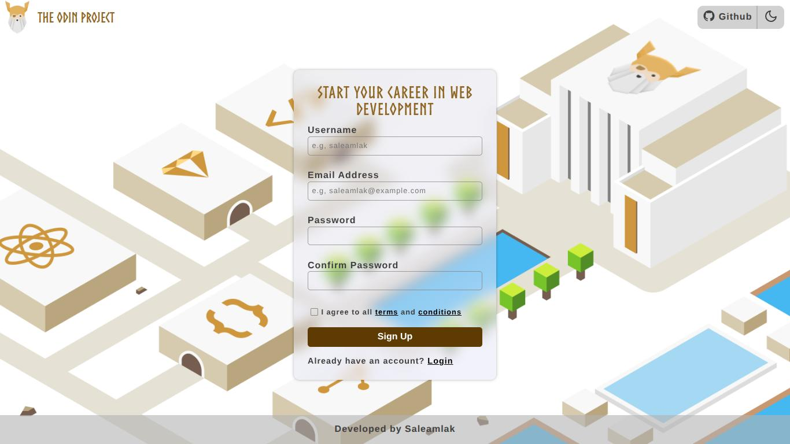
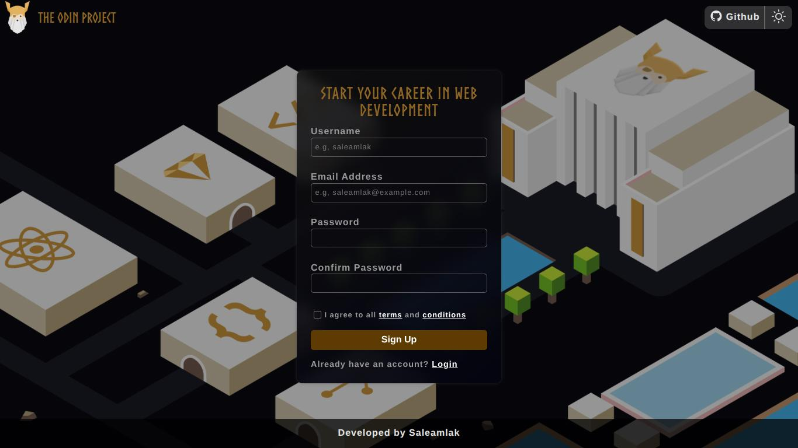

# Sign Up Form

This project is part of **Intermediate HTML and CSS Course** on [The Odin Project](https://www.theodinproject.com).

I created a unique design instead of relying on the provided form template. The form supports both light and dark themes that a user can toggle using a button. To achieve the best visual results, I use custom properties, the project-provided font-face, and linear gradients with a blurred backdrop-filter for the background  to create a modern glass effect. Additionally, I implemented form validation and add style for input hints based on the validation.

[**Live Demo**](https://saleamlakh.github.io/sign-up-form)

## Form Features

- **Theme Toggle**: Includes both Light and Dark modes.

- **Error Styling**: Used CSS pseudo-class `:user-invalid` to style fields only after the user has interacted with them.

- **Form validation**: ensures all required fields are filled correctly. I apply different validation methods.
    - **Constraint Validation**: Uses built-in HTML5 validation.
    - **Email Pattern Matching**: Uses `Regular Expression` to ensure the email follows valid format.
    - **Password Matching**: Used JavaScript to verify that the "Password" and "Confirm Password" fields match.

## Credits
- **Background image, logo and font**: sourced from [The Odin Project](https://www.theodinproject.com).

- **Icons**: sourced from [Feathersicons.com](https://feathericons.com/).